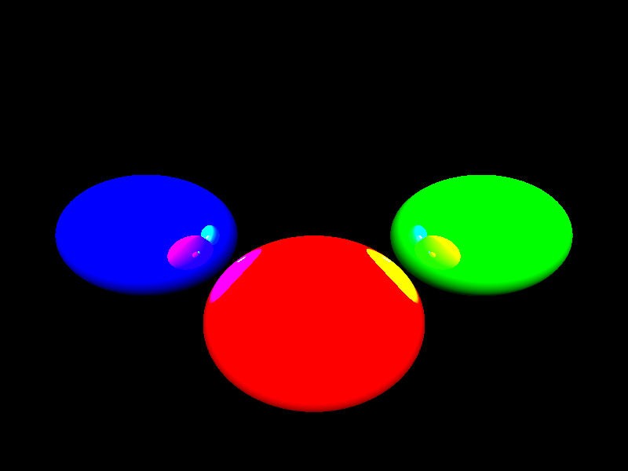

# LLM Python Raytracer - Benchmark/Silly Experiment

This repository contains various Python raytracer implementations generated by different Large Language Models (LLMs) using a single prompt.

## Prompt Used

The following prompt was used for all LLMs:
> Write a raytracer that renders an interesting scene with many colourful lightsources in python. Output a 800x600 image as a png

## Implementations

* [Claude Sonnet](raytracer_sonnet.py)
* [DeepSeek v3](raytracer_DeepSeek_v3.py)
* [DeepSeek R1](raytracer_DeepSeek_r1.py)
* [Gemini Flash Thinking](raytracer_gemini_flash_thinking.py)
* [Grok](raytracer_grok.py)
* [O3-Mini](raytracer_o3-mini.py)
* [4o](raytracer_4o.py)

## Results

### Performance Notes

* Most implementations take several minutes to render, which is not unexpected for a Python raytracer. (Try C next? :D)
* Performance varies between implementations, with some taking significantly longer to complete
* DeepSeek R1 spent 566 thinking and then outputted a broken file. I was not able to restart due to busy server.
* 4o's first attempt required corrections, but the second attempt was successful

### Output Images

Sonnet and 4o produced the most visually appealing images.

<!-- filepath: /d:/LLM/llm_raytracer/Readme.md -->
<table align="center">
  <tr>
    <td align="center">
       
      Sonnet 3.5 (new)
    </td>
    <td align="center">
       
      DeepSeek v3
    </td>
  </tr>
  <tr>
    <td align="center">
       
      4o
    </td>
    <td align="center">
       
      Gemini
    </td>
  </tr>
  <tr>
    <td align="center">
       
      Grok
    </td>
    <td align="center">
       
      O3-Mini
    </td>
  </tr>
</table>

