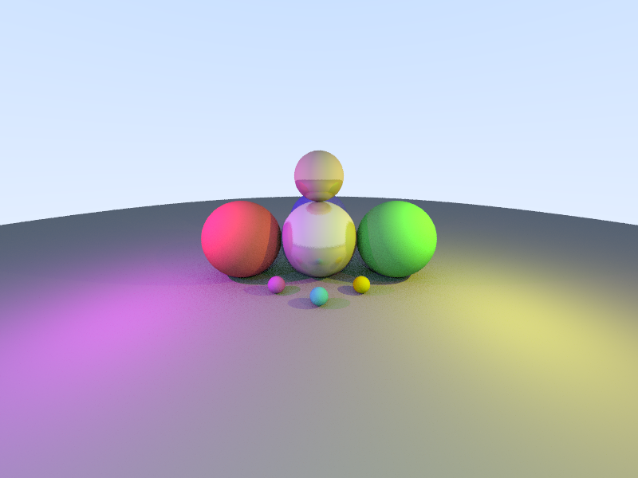
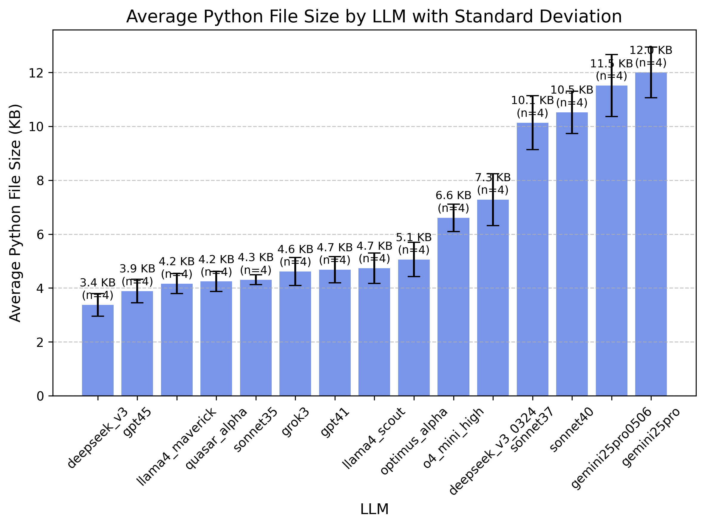

# LLM Python Raytracer - Benchmark/Silly Experiment

This repository contains various Python raytracer implementations generated by different Large Language Models (LLMs) using a single prompt and one attempt.

## Prompt Used

The following prompt was used for all LLMs:
> Write a raytracer that renders an interesting scene with many colourful lightsources in python. Output a 800x600 image as a png

## Implementations

* [Claude Sonnet 3.5 (new)](raytracer_sonnet.py)
* [Claude Sonnet 3.7](raytracer_sonnet37.py)
* [Claude Sonnet 3.7 Thinking](raytracer_sonnet37_thinking.py)
* [DeepSeek v3](raytracer_DeepSeek_v3.py)
* [DeepSeek v3_0324](raytracer_DeepSeek_v3_0324.py)
* [DeepSeek R1](raytracer_DeepSeek_r1.py)
* [Gemini Flash Thinking](raytracer_gemini_flash_thinking.py)
* [Gemini 2 Flash](raytracer_gemini_2_flash.py)
* [Grok 2](raytracer_grok2.py)
* [Grok 3](raytracer_grok3.py)
* [O1](raytracer_o1.py)
* [O3-Mini](raytracer_o3-mini.py)
* [GPT-4o](raytracer_4o.py)
* [GPT-4.5](raytracer_gpt4_5.py)
* [Qwen Max](raytracer_qwen_max.py)
* [QwQ32B](raytracer_qwq32b.py)

The following LLMs did not return properly functioning code: Grok3-thinking, DeepSeek-R1, Le Chat (Mistral Large 2), 8b models, llama3-405b/70b, llama3-hermes3-405b/70b, Hunyuan-T1, Gemini 2 Pro Exp

## Results

### Performance Notes

* Most implementations take several minutes to render, which is not unexpected for a Python raytracer. (Try C next? :D)
* Performance varies between implementations, with some taking significantly longer to complete
* DeepSeek R1 spent 566 thinking and then outputted a broken file. I was not able to restart due to a busy server.
* 4o's first attempt required corrections, but the second attempt was successful

### Output Images for different LLMs

<table align="center">
  <tr>
    <td align="center">
       
      Claude Sonnet 3.5 (new)
    </td>
    <td align="center">
       
      Claude Sonnet 3.7
    </td>
    <td align="center">
       
      Claude Sonnet 3.7 Thinking
    </td>
    <td align="center">
       
      GPT-4o
    </td>
  </tr>
  <tr>
    <td align="center">
       
      DeepSeek v3
    </td>
    <td align="center">
       
      Gemini Flash Thinking
    </td>
    <td align="center">
       
      Gemini 2 Flash
    </td>
    <td align="center">
       
      Grok 2
    </td>
  </tr>
  <tr>
    <td align="center">
       
      Grok 3
    </td>
    <td align="center">
       
      O1
    </td>
    <td align="center">
       
      O3-Mini
    </td>
    <td align="center">
       
      Qwen Max
    </td>
  </tr>
  <tr>
    <td align="center">
       
      GPT-4.5
    </td>
    <td align="center">
       
      QwQ32B
    </td>
    <td align="center">
       
      Codestral
    </td>
    <td align="center">
       
      Deepseek V3 0324
    </td>
  </tr>
</table>

### Variability test

Since the tests above are based on one-shot prompts, they are not necessarily representative of the LLM's average capabilities. I ran the experiment 4 times with [Sonnet-3.5](variance_sonnet35/), [Sonnet-3.7](variance_sonnet37/), [GPT4.5](variance_gpt45/) and [grok3](variance_grok3/) to test for consistency.

We can clearly see a significant change in behavior between the two models. Sonnet-3.5 produces slight variations of a basic scene with red, green and blue spheres, while Sonnet-3.7 uses more objects, colors and more variations in general. GPT 4.5 and Grok3 are also more of a three-sphere llm.

#### Claude Sonnet 3.5 Variance Test

<table align="center">
  <tr>
    <td align="center">
      
    </td>
    <td align="center">
      
    </td>
    <td align="center">
      
    </td>
    <td align="center">
      
    </td>
  </tr>
</table>

#### Claude Sonnet 3.7 Variance Test

<table align="center">
  <tr>
    <td align="center">
      
    </td>
    <td align="center">
      
    </td>
    <td align="center">
      
    </td>
    <td align="center">
      
    </td>
  </tr>
</table>

#### DeepSeek V3 (original) Variance Test

<table align="center">
  <tr>
    <td align="center">
      
    </td>
    <td align="center">
      
    </td>
    <td align="center">
      
    </td>
    <td align="center">
      
    </td>
  </tr>
</table>

#### DeepSeek V3 (0324) Variance Test

<table align="center">
  <tr>
    <td align="center">
      
    </td>
    <td align="center">
      
    </td>
    <td align="center">
      
    </td>
    <td align="center">
      
    </td>
  </tr>
</table>

#### GPT 4.5 Variance Test

<table align="center">
  <tr>
    <td align="center">
      
    </td>
    <td align="center">
      
    </td>
    <td align="center">
      
    </td>
    <td align="center">
      
    </td>
  </tr>
</table>

#### Grok3 Variance Test

<table align="center">
  <tr>
    <td align="center">
      
    </td>
    <td align="center">
      
    </td>
    <td align="center">
      
    </td>
    <td align="center">
      
    </td>
  </tr>
</table>

#### File sizes

There is a notable correlation between code creativity and file size.

  

