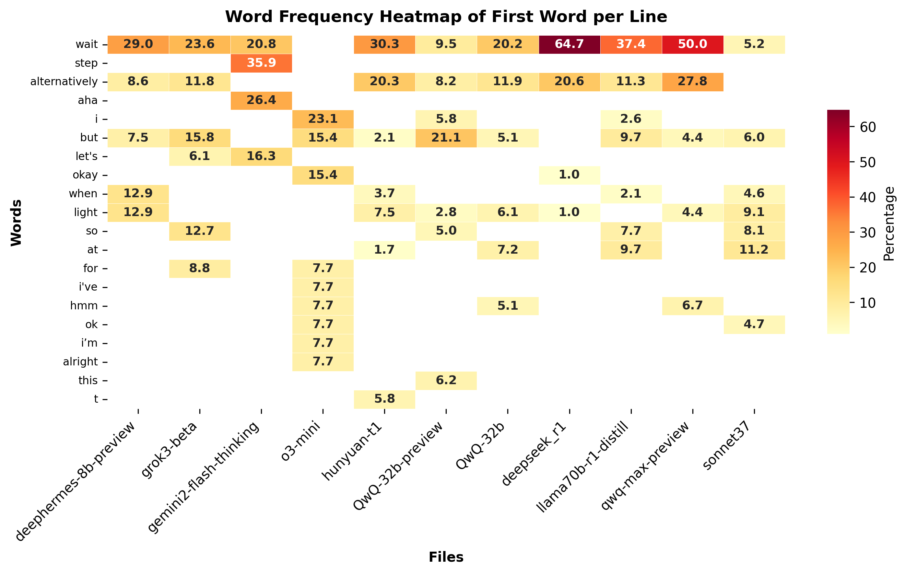

# LLM Thinking Trace Analyzer

This tool analyzes word statistics in chain-of-thought traces of reasoning from large language models. This is an attempt to compare the thinking processes between different models.

## Background & Purpose

All investigated LLMs were prompted with the prompt below, and the (sometimes partial) reasoning traces were stored as .txt files to be analyzed.

> You have two ropes, each of which takes exactly 60 minutes to burn completely. However, the ropes burn unevenly, meaning some parts may burn faster or slower than others. You have no other timing device. How can you measure exactly 20 minutes using these two ropes and matches to light them?

This specific prompt consistently generates long thinking traces across different models. It is an unsolvable logical puzzle, a fact which cannot be deduced logically by most of the current reasoning models.

By analyzing the first word of each line in these reasoning traces, we can identify relationships between different models and potentially reveal insights about training methodologies.

## Output and Insights



The heatmap colors indicate the frequency percentage of each word appearing as the first word in lines. 

By comparing these patterns, we can infer relationships between different models, their training processes, and potentially identify when the output of one model was used to finetuned another.

The analysis of word statistics across various models reveals several interesting patterns. Certain critical words/tokens like "wait" and "alternatively" emerge and indicate backtracking and other steps in the thinking process. The general assumption is that these critical tokens have already been learned during pre-training and are then amplified by reinforcement learning. 

The [R1 paper](https://arxiv.org/abs/2501.12948), however, has shown that reinforcement learning on a bare base model does lead to erratic thinking traces (The "R1-Zero" model was generated that way). Instead, R1 was fine-tuned (primed) with prefiltered thinking traces from R1-Zero and other sources before they started with RL. We can see the complete absence of "wait/alternatively" from the R1-Zero trace, so the occurrence of these tokens in R1 is due to the additional finetuning step.

Now, if others are also using R1 traces to finetune their models before reinforcement learning, they'll end up with the same critical tokens, which could explain the statistical similarities we are seeing here. As a caveat, this is based on limited statistics and is rather a hypothesis at this point.

Gemini, Sonnet, and o3-mini use different critical tokens, which may indicate that these models were primed in a different way. Also, the first Qwen-32b-preview, which was trained using a process reward model instead of RLHF, uses different critical tokens (see "but"). Qwen most likely adopted a different reinforcement learning approach for the final version of the model.

## Usage

Install dependencies with:
```bash
pip install pandas seaborn matplotlib
```

Run the analyzer on a folder containing text files with thinking traces:

```bash
python extract.py <folder_path>
```

For example:
```bash
python extract.py .
```

## Output

The tool generates several outputs:

1. **Text-based frequency histograms** for each file, showing the top 10 most common first words
2. **Comparison matrix** displaying the percentage frequency of common words across all files
3. **Heatmap visualization** saved as `word_frequency_heatmap.png`, providing a visual comparison of word frequencies

